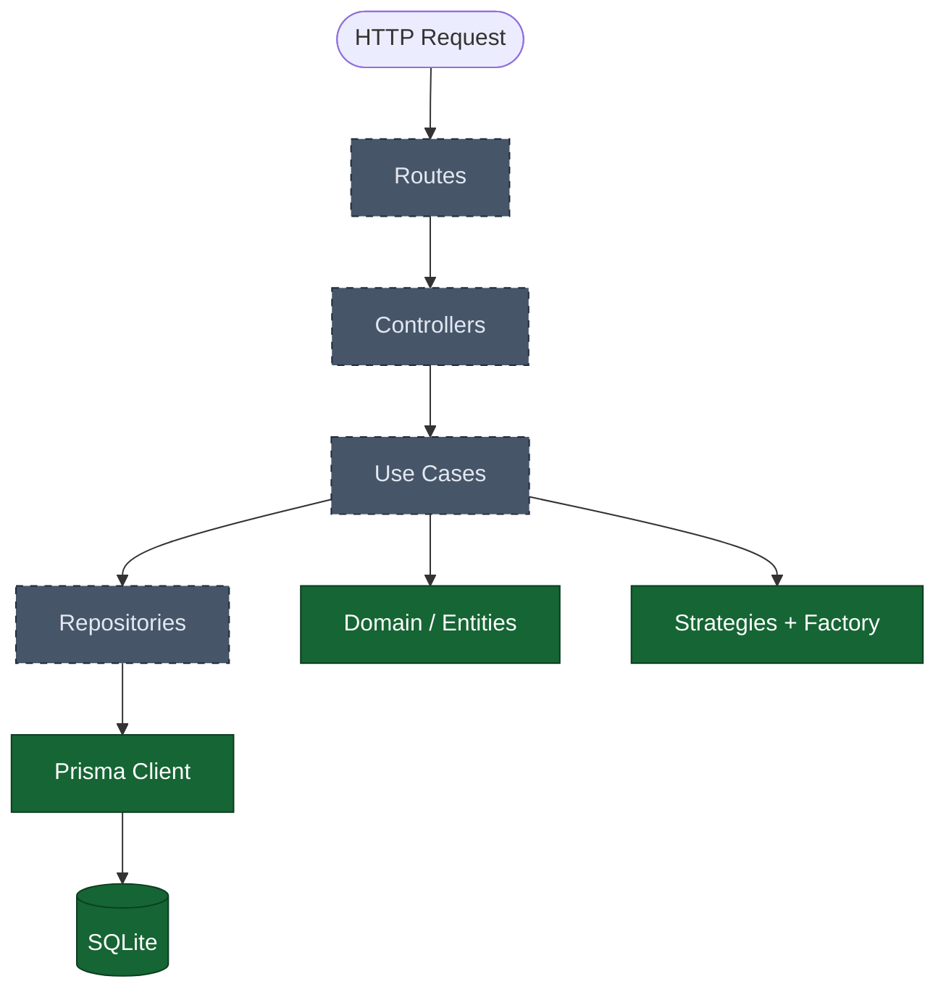
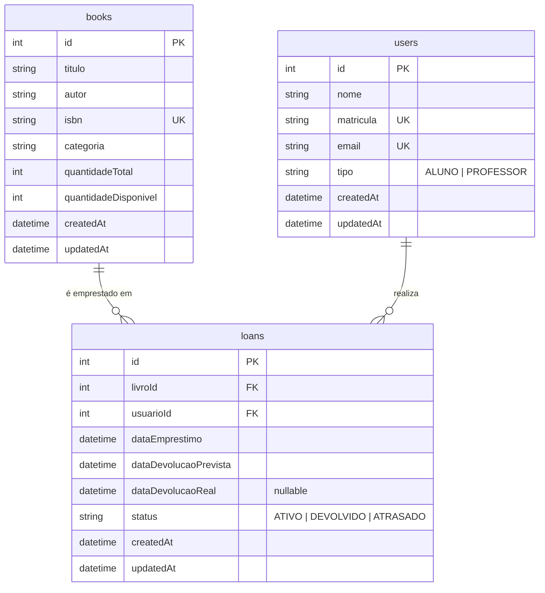

# 📚 Library API

> API REST para gerenciamento de biblioteca — livros, usuários e empréstimos —
> desenvolvida como projeto acadêmico aplicando Clean Architecture, DDD, SOLID e padrões de projeto.


---

## 🚦 Status do projeto

O projeto está em desenvolvimento. Esta tabela reflete **exatamente** o que já existe no código:

| Camada / Item                                             | Status       |
| --------------------------------------------------------- | ------------ |
| Configuração do projeto (ESLint, Prettier, Jest, scripts) | ✅ Concluído |
| Banco de dados (schema, migration, seed)                  | ✅ Concluído |
| Domínio — entidades `Book`, `User`, `Loan`                | ✅ Concluído |
| Domínio — Strategy + Factory Method                       | ✅ Concluído |
| Tratamento de erros — `AppError`                          | ✅ Concluído |
| Repositories (abstrações + implementações Prisma)         | 🚧 Pendente  |
| Use Cases (books / users / loans)                         | 🚧 Pendente  |
| Controllers, Routes e Middlewares                         | 🚧 Pendente  |
| Validação com Zod                                         | 🚧 Pendente  |
| `app.js` / `server.js`                                    | 🚧 Pendente  |
| Documentação Swagger                                      | 🚧 Pendente  |
| Testes (Jest + Supertest)                                 | 🚧 Pendente  |

> ⚠️ Como o servidor HTTP ainda não foi implementado, **não existem endpoints disponíveis**.
> As seções [Endpoints](#-endpoints), [Swagger](#-swagger), [Testes](#-testes) e [TDD](#-tdd)
> serão preenchidas conforme forem implementadas.

---

## 📑 Índice

- [Sobre o projeto](#-sobre-o-projeto)
- [Funcionalidades](#-funcionalidades)
- [Regras de negócio](#-regras-de-negócio)
- [Tecnologias](#️-tecnologias)
- [Arquitetura](#️-arquitetura)
- [Padrões de projeto](#-padrões-de-projeto)
- [SOLID](#-solid)
- [Banco de dados](#️-banco-de-dados)
- [Endpoints](#-endpoints)
- [Swagger](#-swagger)
- [Testes](#-testes)
- [TDD](#-tdd)
- [Como executar](#-como-executar)
- [Estrutura do projeto](#-estrutura-do-projeto)
- [Integrantes](#-integrantes)
- [Contexto acadêmico](#-contexto-acadêmico)

---

## 📖 Sobre o projeto

Bibliotecas que controlam empréstimos manualmente enfrentam três problemas recorrentes:
não sabem quantos exemplares de um título ainda estão disponíveis, não conseguem impedir
que um usuário inadimplente leve mais livros, e não têm como aplicar prazos diferentes
para perfis diferentes de usuário.

A **Library API** resolve isso centralizando o acervo e os empréstimos em uma API REST.
O sistema controla o estoque de exemplares a cada empréstimo e devolução, calcula
automaticamente o prazo de devolução conforme o perfil do usuário e bloqueia operações
que violem as regras da biblioteca.

O objetivo acadêmico é demonstrar, em um domínio realista, a aplicação de
**Clean Architecture**, **DDD**, princípios **SOLID** e **padrões de projeto GoF/GRASP**.

---

## ✨ Funcionalidades

### Implementadas

- [x] Modelagem do acervo, dos usuários e dos empréstimos (entidades de domínio)
- [x] Controle de estoque de exemplares (baixa no empréstimo, retorno na devolução)
- [x] Cálculo automático do prazo de devolução conforme o tipo de usuário
- [x] Identificação de empréstimos em atraso
- [x] Bloqueio de devolução duplicada
- [x] Ajuste seguro da quantidade total de exemplares de um livro
- [x] Erros de negócio com status HTTP próprio (`AppError`)
- [x] Persistência em SQLite via Prisma (schema + migration)
- [x] Seed com dados de demonstração

### Em desenvolvimento

- [ ] CRUD de livros, usuários e empréstimos via HTTP
- [ ] Endpoint de devolução
- [ ] Validação de entrada com Zod
- [ ] Tratamento global de erros (middleware)
- [ ] Documentação Swagger
- [ ] Testes automatizados

---

## 📋 Regras de negócio

O domínio implementa as regras abaixo. A coluna **Onde está** aponta o arquivo real que contém cada uma:

| #   | Regra                                                              | Onde está                                          | Status                                               |
| --- | ------------------------------------------------------------------ | -------------------------------------------------- | ---------------------------------------------------- |
| 1   | Um usuário pode ter no máximo **3 empréstimos ativos** simultâneos | `Loan.js` → `LIMITE_EMPRESTIMOS_ATIVOS`            | 🚧 Constante definida; validação depende do Use Case |
| 2   | **Professor** tem prazo maior que **aluno**: 14 dias contra 7      | `StudentLoanStrategy.js`, `TeacherLoanStrategy.js` | ✅                                                   |
| 3   | Usuário com empréstimo **atrasado** não pode fazer novo empréstimo | —                                                  | 🚧 Depende do Use Case                               |
| 4   | Livro **sem exemplar disponível** não pode ser emprestado          | `Book.js` → `emprestarExemplar()`                  | ✅                                                   |
| 5   | Empréstimo **diminui em 1** a quantidade disponível                | `Book.js` → `emprestarExemplar()`                  | ✅                                                   |
| 6   | Devolução **aumenta em 1** a quantidade disponível                 | `Book.js` → `devolverExemplar()`                   | ✅                                                   |
| 7   | Empréstimo já devolvido **não pode ser devolvido novamente**       | `Loan.js` → `devolver()`                           | ✅                                                   |
| 8   | Empréstimo ativo vencido passa a ser considerado **ATRASADO**      | `Loan.js` → `estaAtrasado()` / `statusAtual()`     | ✅                                                   |

### Prazos de devolução

| Tipo de usuário | Prazo   |
| --------------- | ------- |
| `ALUNO`         | 7 dias  |
| `PROFESSOR`     | 14 dias |

### Detalhe de implementação — o status `ATRASADO`

O atraso **não é gravado no banco por uma rotina agendada**. Ele é derivado no momento da
consulta, comparando a data atual com a `dataDevolucaoPrevista`:

```js
statusAtual(dataReferencia = new Date()) {
  if (this.estaDevolvido()) return STATUS_EMPRESTIMO.DEVOLVIDO;
  return this.estaAtrasado(dataReferencia) ? STATUS_EMPRESTIMO.ATRASADO : STATUS_EMPRESTIMO.ATIVO;
}
```

Assim o sistema continua correto mesmo que a API fique dias sem ser usada, e o parâmetro
`dataReferencia` torna o comportamento testável sem depender do relógio da máquina.

---

## 🛠️ Tecnologias

| Tecnologia                               | Utilização                    | Status no projeto                 |
| ---------------------------------------- | ----------------------------- | --------------------------------- |
| **Node.js 18+**                          | Runtime                       | Em uso                            |
| **Express 4**                            | Framework HTTP / API REST     | Instalado (servidor pendente)     |
| **Prisma 6**                             | ORM                           | Em uso                            |
| **SQLite**                               | Banco de dados                | Em uso                            |
| **Zod 3**                                | Validação de entrada          | Instalado (validators pendentes)  |
| **Jest 29**                              | Testes unitários              | Configurado (sem testes ainda)    |
| **Supertest 7**                          | Testes de integração HTTP     | Instalado (testes pendentes)      |
| **swagger-ui-express / swagger-autogen** | Documentação da API           | Instalado (configuração pendente) |
| **ESLint 9**                             | Análise estática              | Em uso                            |
| **Prettier 3**                           | Formatação de código          | Em uso                            |
| **dotenv**                               | Variáveis de ambiente         | Em uso                            |
| **nodemon**                              | Hot reload em desenvolvimento | Instalado                         |

---

## 🏗️ Arquitetura

O projeto segue **Clean Architecture em camadas**. A regra fundamental é que as dependências
apontam sempre **para dentro**: o domínio não conhece ninguém, e a infraestrutura é um
detalhe substituível.

```
Request → Routes → Controllers → Use Cases → Repositories → Prisma → SQLite
```

| Camada             | Pasta                | Responsabilidade                                   | Pode depender de       |
| ------------------ | -------------------- | -------------------------------------------------- | ---------------------- |
| **Domain**         | `src/domain`         | Entidades, regras de negócio, Strategies e Factory | Nada (JavaScript puro) |
| **Application**    | `src/application`    | Use Cases — orquestram domínio e repositórios      | Domínio e abstrações   |
| **Infrastructure** | `src/infrastructure` | Prisma Client e repositórios concretos             | Domínio e Prisma       |
| **Interfaces**     | `src/interfaces`     | Controllers, Routes, Middlewares, Validators       | Application            |



> 🟩 verde = já implementado · ⬜ tracejado = pendente

### Por que o domínio não conhece o Prisma

As entidades `Book`, `User` e `Loan` são classes JavaScript puras. Elas não importam
Express nem Prisma, o que significa que as regras de negócio podem ser testadas sem
subir servidor e sem tocar no banco — e que trocar SQLite por PostgreSQL não altera
uma linha de regra de negócio.

---

## 🎯 Padrões de projeto

### Strategy (GoF) ✅

|              |                                                                                                                                      |
| ------------ | ------------------------------------------------------------------------------------------------------------------------------------ |
| **Problema** | O prazo de devolução muda conforme o tipo de usuário. Resolver com `if (tipo === 'PROFESSOR')` espalharia condicionais pelo sistema. |
| **Solução**  | Cada tipo de usuário tem uma estratégia com o mesmo contrato. Quem calcula o prazo é a estratégia, não o chamador.                   |
| **Onde**     | `src/domain/strategies/LoanDeadlineStrategy.js` (abstração), `StudentLoanStrategy.js` (7 dias), `TeacherLoanStrategy.js` (14 dias)   |
| **Por quê**  | Adicionar um novo perfil de usuário vira uma classe nova, sem alterar código existente.                                              |

A aritmética de datas fica na classe abstrata; cada estratégia concreta declara apenas o próprio prazo:

```js
class StudentLoanStrategy extends LoanDeadlineStrategy {
  getDiasDePrazo() {
    return DIAS_PRAZO_ALUNO; // 7
  }
}
```

### Factory Method (GoF) ✅

|              |                                                                                                                                     |
| ------------ | ----------------------------------------------------------------------------------------------------------------------------------- |
| **Problema** | Alguém precisa decidir **qual** estratégia usar. Se essa decisão ficar no Use Case, volta o `if/else` que o Strategy veio eliminar. |
| **Solução**  | Centralizar a seleção em uma fábrica que recebe o tipo do usuário e devolve a estratégia correta.                                   |
| **Onde**     | `src/domain/strategies/LoanStrategyFactory.js`                                                                                      |
| **Porquê**  | O Use Case pede a estratégia e recebe algo que respeita o contrato, sem conhecer as classes concretas.                              |

A seleção usa um mapa em vez de `switch`, o que torna a extensão trivial:

```js
const ESTRATEGIAS_POR_TIPO = {
  [TIPOS_USUARIO.ALUNO]: StudentLoanStrategy,
  [TIPOS_USUARIO.PROFESSOR]: TeacherLoanStrategy,
};
```

### Information Expert (GRASP) ✅

Quem sabe quantos exemplares existem é o próprio livro — então é o `Book` que controla a
baixa e o retorno de exemplares, protegendo a própria invariante:

```js
emprestarExemplar() {
  if (!this.temExemplarDisponivel()) {
    throw new AppError('Nao ha exemplares disponiveis deste livro para emprestimo.', 409);
  }
  this.quantidadeDisponivel -= 1;
}
```

### Repository (GRASP) 🚧

Padrão previsto na arquitetura (pastas `src/domain/repositories` e
`src/infrastructure/repositories` já existem), mas **ainda não implementado**.

---

## 🧱 SOLID

| Princípio | Onde aparece hoje no código                                                                                                                                                               |
| --------- | ----------------------------------------------------------------------------------------------------------------------------------------------------------------------------------------- |
| **SRP**   | Cada entidade cuida apenas das próprias invariantes: `Book` controla estoque, `Loan` controla status e devolução. O cálculo de prazo não está em nenhuma das duas — está nas estratégias. |
| **OCP**   | Incluir um perfil "BIBLIOTECARIO com 30 dias" exige uma classe nova e **uma linha** no mapa da `LoanStrategyFactory`. Nenhum código existente é alterado.                                 |
| **LSP**   | `StudentLoanStrategy` e `TeacherLoanStrategy` substituem `LoanDeadlineStrategy` sem quebrar nada: mesmo contrato, sem pré-condições adicionais.                                           |
| **ISP**   | A abstração `LoanDeadlineStrategy` expõe apenas o necessário — `getDiasDePrazo()` e `calcularDataDevolucao()`. Nenhuma estratégia é obrigada a implementar método que não usa.            |
| **DIP**   | 🚧 Previsto: os Use Cases receberão os repositórios por construtor e dependerão das abstrações, nunca do Prisma. Ainda não implementado.                                                  |

---

## 🗄️ Banco de dados

**SQLite** gerenciado pelo **Prisma ORM**. O banco é criado em `prisma/dev.db` pela migration.

### Entidades e relacionamentos

- Um **livro** pode ter vários empréstimos (1:N)
- Um **usuário** pode ter vários empréstimos (1:N)
- Um **empréstimo** pertence a exatamente um livro e um usuário



### Por que `tipo` e `status` são `String` e não `enum`

O provider **SQLite não suporta `enum` no Prisma** — é uma limitação do banco, não do ORM.
Os valores válidos são garantidos em duas camadas:

1. **Domínio** — as constantes `TIPOS_USUARIO` e `STATUS_EMPRESTIMO` são a fonte da verdade;
2. **Borda da aplicação** — validação com `z.enum` antes de os dados chegarem ao Use Case.

### Chaves estrangeiras

As FKs usam `ON DELETE RESTRICT`: não é possível apagar um livro ou usuário que ainda
possua empréstimos registrados.

### Dados de demonstração (seed)

O seed popula o banco com um cenário preparado para demonstrar as regras de negócio:

| Registro                                | Serve para demonstrar                   |
| --------------------------------------- | --------------------------------------- |
| Aluno com 1 empréstimo ativo            | Prazo de 7 dias                         |
| Professor sem empréstimos               | Prazo de 14 dias                        |
| Aluno com empréstimo vencido há 13 dias | Bloqueio por atraso e status `ATRASADO` |
| Livro com `quantidadeDisponivel: 0`     | Bloqueio por falta de exemplar          |
| 5 livros no total                       | Listagem e consultas                    |

---

## 🔌 Endpoints

🚧 **Nenhum endpoint disponível ainda.** As rotas HTTP, os controllers e o servidor Express
não foram implementados.

Esta seção será preenchida com a tabela de rotas reais assim que a camada de interfaces existir.

---

## 📚 Swagger

🚧 **Ainda não configurado.** As dependências `swagger-ui-express` e `swagger-autogen` já estão
instaladas e o script `npm run swagger` já existe no `package.json`, mas o arquivo `swagger.js`
ainda não foi criado.

---

## 🧪 Testes

🚧 **Nenhum teste escrito ainda.** O Jest já está configurado em `jest.config.js`, com:

- ambiente `node`;
- busca por arquivos em `tests/**/*.test.js`;
- limite mínimo de cobertura de **40%** — o comando de cobertura falha se ficar abaixo disso;
- `src/server.js` e `src/infrastructure/database/prisma.js` fora da medição, por serem apenas bootstrap.

Comandos disponíveis no `package.json`:

```bash
npm test              # executa os testes
npm run test:watch    # modo watch
npm run test:coverage # gera o relatório de cobertura
```

> Executar `npm test` agora retorna _"No tests found"_, pois a pasta `tests/` ainda está vazia.

---

## 🔴🟢 TDD

🚧 **Ainda não iniciado.** A funcionalidade escolhida para ser desenvolvida em TDD é
**"usuário com empréstimo atrasado não pode realizar novo empréstimo"** (Regra 3), que depende
do `CreateLoanUseCase`.

Esta seção será preenchida com o registro real do ciclo **Red → Green → Refactor** quando
a implementação acontecer. Nenhum histórico será documentado antes de existir.

---

## 🚀 Como executar

### Pré-requisitos

- Node.js 18 ou superior
- npm

### 1. Clonar e instalar

```bash
git clone https://github.com/kaikehttps/library-api.git
cd library-api
npm install
```

### 2. Configurar as variáveis de ambiente

Crie um arquivo chamado `.env` na raiz do projeto com o conteúdo abaixo.
Ele não vem no repositório porque está no `.gitignore` — arquivos de ambiente não devem ser versionados.

```env
# Conexão do Prisma com o SQLite.
# O caminho é relativo à pasta "prisma/", então o banco é criado em prisma/dev.db
DATABASE_URL="file:./dev.db"

# Porta HTTP da API
PORT=3000

# Ambiente de execução (development | test | production)
NODE_ENV=development
```

Atalho para criar o arquivo já preenchido:

```bash
# Windows (PowerShell)
@('DATABASE_URL="file:./dev.db"', 'PORT=3000', 'NODE_ENV=development') | Set-Content -Encoding utf8 .env

# Linux / macOS
printf 'DATABASE_URL="file:./dev.db"\nPORT=3000\nNODE_ENV=development\n' > .env
```

### 3. Preparar o banco de dados

```bash
npx prisma generate     # gera o Prisma Client
npx prisma migrate dev  # cria o banco e aplica as migrations
npm run seed            # popula com dados de demonstração
```

### 4. Qualidade de código

```bash
npm run lint         # verifica problemas
npm run lint:fix     # corrige automaticamente
npm run format       # formata com Prettier
npm run format:check # apenas verifica a formatação
```

### Comandos que ainda não funcionam

Os scripts abaixo já existem no `package.json`, mas dependem de arquivos ainda não implementados:

| Comando                     | Depende de           |
| --------------------------- | -------------------- |
| `npm run dev` / `npm start` | `src/server.js`      |
| `npm test`                  | arquivos em `tests/` |
| `npm run swagger`           | `swagger.js`         |

### Utilitário

```bash
npx prisma studio  # interface visual para inspecionar o banco
```

---

## 📁 Estrutura do projeto

Árvore real do repositório. Pastas marcadas com `(vazia)` já existem, mas ainda não têm arquivos:

```text
library-api/
├── prisma/
│   ├── migrations/
│   │   └── 20260914173406_init/
│   │       └── migration.sql
│   ├── schema.prisma
│   └── seed.js
│
├── src/
│   ├── domain/
│   │   ├── entities/
│   │   │   ├── Book.js
│   │   │   ├── Loan.js
│   │   │   └── User.js
│   │   ├── repositories/        (vazia)
│   │   └── strategies/
│   │       ├── LoanDeadlineStrategy.js
│   │       ├── LoanStrategyFactory.js
│   │       ├── StudentLoanStrategy.js
│   │       └── TeacherLoanStrategy.js
│   │
│   ├── application/
│   │   └── useCases/
│   │       ├── books/           (vazia)
│   │       ├── loans/           (vazia)
│   │       └── users/           (vazia)
│   │
│   ├── infrastructure/
│   │   ├── database/
│   │   │   └── prisma.js
│   │   └── repositories/        (vazia)
│   │
│   ├── interfaces/
│   │   ├── controllers/         (vazia)
│   │   ├── middlewares/         (vazia)
│   │   ├── routes/              (vazia)
│   │   └── validators/          (vazia)
│   │
│   ├── utils/
│   │   └── errors/
│   │       └── AppError.js
│   │
│   └── config/                  (vazia)
│
├── tests/
│   ├── integration/             (vazia)
│   └── unit/
│       ├── strategies/          (vazia)
│       └── useCases/            (vazia)
│
├── docs/                        (vazia)
├── .gitignore
├── .prettierrc
├── .prettierignore
├── eslint.config.js
├── jest.config.js
├── package.json
└── README.md
```

### Decisões de estrutura

- **`src/domain/repositories/`** — guarda os contratos dos repositórios. Ter as abstrações como arquivos concretos é o que torna a inversão de dependência verificável, e não apenas uma intenção.
- **`src/config/`** — abrigará a composição central das dependências. Fica fora de `interfaces/` para não misturar tratamento de HTTP com montagem de objetos.
- **`AppError` em `src/utils/errors/`** — módulo transversal sem dependências, podendo ser usado tanto pelo domínio quanto pelas demais camadas sem violar a regra de dependência.

---

## 👥 Integrantes

- Nome do integrante 1
- Nome do integrante 2

---

## 🎓 Contexto acadêmico

Projeto desenvolvido como atividade acadêmica, com foco na aplicação prática de:

- APIs REST
- Clean Architecture
- Domain-Driven Design (DDD)
- Princípios SOLID
- Padrões de projeto GoF e GRASP
- Test-Driven Development (TDD)
- Documentação de APIs

---

<div align="center">

Licenciado sob **MIT**

</div>
